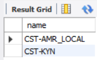

# Assignment 1 : DBMS
## MIS No.: 612303083 (TY 1, ADS 4)

## Q.1 University

### DQL - Solution queries:
- Code:
```
-- Find the names of all the students whose total credits are greater than 100.
SELECT name FROM student WHERE tot_cred > 100;
```
- Output:


- Code:
```
-- Find the course id and grades of all courses taken by any student named 'Tanaka'.
SELECT takes.course_id, takes.grade
FROM student
INNER JOIN takes
ON student.ID = takes.ID
where name = "Tanaka";
```
- Output:


- Code:
```
-- Find the courses which are offered in both 'Fall' and 'Spring' semester (not necessarily in the same year).
SELECT title
FROM course
INNER JOIN section
ON course.course_id = section.course_id
WHERE semester = 'Fall'
	AND section.course_id IN (
		SELECT course_id
		FROM section
		WHERE semester = 'Spring'
    );
```
- Output:


- Code:
```
-- Find the names of all the instructors from Comp. Sci. department.
SELECT name FROM instructor WHERE dept_name = 'Comp. Sci.';
```
- Output:


- Code:
```
-- Find the course id and titles of all courses taught by an instructor named 'Srinivasan'
SELECT DISTINCT course.course_id, course.title
FROM course
JOIN teaches ON course.course_id = teaches.course_id
JOIN instructor ON teaches.ID = instructor.ID
WHERE instructor.name = 'Srinivasan';
```
- Output:


- Code:
```
-- Find the names of instructors who have taught at least one course in Spring 2009.
SELECT DISTINCT name FROM instructor
JOIN teaches ON instructor.ID = teaches.ID
JOIN section ON teaches.course_id = section.course_id
WHERE section.semester = 'Spring' AND section.year = 2009;
```
- Output:


## Q.2 Railway Station

### DQL - Solution queries:
- Code:
```
-- Find pairs of stations (station codes) that have a track (direct connection) with distance less than 20Kms between them.
SELECT stcode1, stcode2
FROM track
WHERE distance < 20;
```
- Output:


- Code:
```
-- Find the IDs of all the trains which have a stop at THANE
SELECT id
FROM trainhalts
JOIN station
ON trainhalts.stcode = station.stcode
WHERE station.name = 'Thane';
```
- Output:


- Code:
```
-- Find the names of all trains that start at MUMBAI.
SELECT train.name
FROM train
JOIN trainhalts ON train.id = trainhalts.id
JOIN station ON trainhalts.stcode = station.stcode
WHERE trainhalts.seqno = 0 AND station.name = 'Mumbai';
```
- Output:


- Code:
```
-- List all the stations in order of visit by the train 'CST-AMR_LOCAL'.
SELECT station.name
FROM station
JOIN trainhalts ON station.stcode = trainhalts.stcode
JOIN train ON trainhalts.id = train.id
WHERE train.name = 'CST-AMR_LOCAL'
ORDER BY trainhalts.seqno;
```
- Output:


