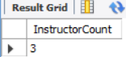

# Assignment 2 : DBMS
## MIS No.: 612303083 (TY 1, ADS 3)

## Q.1 Aggregates, Grouping and Ordering -
### DQL - Solution queries:
- Code:
```
-- Find the number of instructors who have never taught any course. If the result of your query is empty, add the appropriate data (and include corresponding insert statements) to ensure the result is not empty.NOTE:  IN THE SUBMISSION  FILE, PASTE  DATA INSERTED BELOW THIS STATEMENT AS A REMARK.
SELECT COUNT(DISTINCT instructor.ID) AS InstructorCount
FROM instructor, teaches
WHERE instructor.ID NOT IN (SELECT ID FROM teaches);
```
- Output:


- Code:
```
-- Find the total capacity of every building in the university.
SELECT section.building, SUM(DISTINCT classroom.capacity) AS TotalCapacity
FROM section, classroom
WHERE section.building = classroom.building
GROUP BY section.building;
```
- Output:


- Code:
```
-- Find all departments that have at least one instructor, and list the names of the departments along with the number of instructors;   order the result in descending order of number of instructors. 
SELECT instructor.dept_name, COUNT(DISTINCT instructor.ID) AS InstructorCount
FROM instructor
GROUP BY dept_name
ORDER BY InstructorCount DESC;
```
- Output:


- Code:
```
-- For each student, compute the total credits they have successfully completed, i.e. total credits of courses they have taken, for which they have a non-null grade other than 'F'. Do NOT use the tot_credits attribute of student.
SELECT student.name, SUM(course.credits) AS TotalCredits
FROM student, takes, course
WHERE student.ID = takes.ID AND takes.course_id = course.course_id AND takes.grade <> 'F'
GROUP BY student.name;
```
- Output:


## Q.2 Nested Subqueries -

### DQL - Solution queries:
- Code:
```
-- Find the id and title of all courses which do not require any  prerequisites.
SELECT course_id, title
FROM course
WHERE course_id NOT IN (SELECT course_id from prereq);
```
- Output:


- Code:
```
-- Find the names of students who have not taken any biology dept. courses.
SELECT name
FROM student
WHERE ID NOT IN (
	SELECT takes.ID
    FROM takes, course
    WHERE takes.course_id = course.course_id AND course.dept_name = 'Biology'
);
```
- Output:


